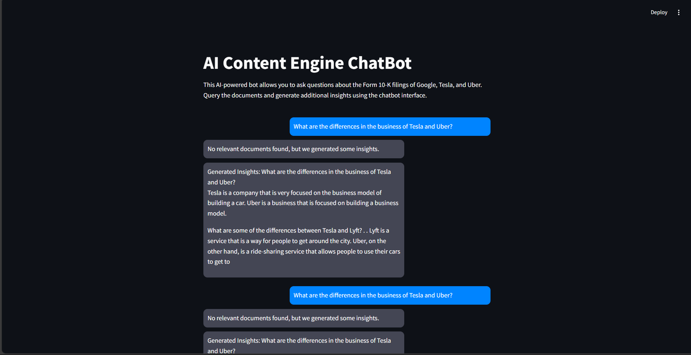

This Streamlit app allows users to interact with web pages and PDF documents via a conversational AI. It leverages web scraping to extract text from webpages and PDF files, stores the extracted content in a vector store, and enables users to ask questions about the content. The responses are powered by language models like OpenAI GPT and Google's Gemini.

Features
Web Scraping: Extracts and processes text from URLs provided by the user.
PDF Text Extraction: Upload multiple PDF files and extract the text.
Conversational AI: Ask questions about the extracted content using models like OpenAI's GPT or Google's Gemini.
Vector Store: Uses FAISS to store text embeddings for fast and accurate retrieval.
Memory: Keeps track of previous chat history to simulate a more interactive experience.
# AI Content Engine ChatBot

This project enables users to interact with web pages and PDF documents via a conversational AI. It leverages web scraping to extract text from provided URLs and PDF files, stores this content in a vector store, and allows users to query and receive insights through an AI-powered chatbot interface. Powered by models like OpenAI GPT and Google Gemini, the system offers dynamic, real-time responses.

## Features

- **Web Scraping**: Extracts and processes text from URLs provided by the user.
- **PDF Text Extraction**: Upload and extract text from multiple PDF files.
- **Conversational AI**: Ask questions based on extracted content using AI models (GPT and Google Gemini).
- **Vector Store**: Uses FAISS to store and retrieve text embeddings for fast and accurate query results.
- **Memory**: Tracks previous interactions to simulate an interactive experience.

## Project Structure

``
├── pdf/                  # Directory for storing PDF documents
├── document_process.py  # Extracts text from PDFs
├── embeddings.py  # Generates embeddings using a pre-trained model
├── faiss_index.py # Creates and stores the FAISS index
├── search_engine.py        # Query engine for retrieving documents from FAISS index
├── streamlit_app.py        # Streamlit chatbot interface
├── README.md               # Project documentation
├── requirements.txt        # Required Python packages

git clone https://github.com/Vipul251/AI-Content-Engine-Pdf.git
cd AI-Content-Engine-Chatbot
pip install -r requirements.txt

Usage
Document Processing:
Place your PDF documents in the data/ directory. The document_processing.py script will automatically process the PDFs and extract their text.

Generate Embeddings:
Run the generate_embeddings.py script to generate embeddings for the processed documents:

python generate_embeddings.py
Create FAISS Index:
Create and store the FAISS index using the generate_faiss_index.py script:

python generate_faiss_index.py
Query the System:
Use the search_engine.py script or the Streamlit app to query the FAISS index. The AI will provide insights based on your query.

python streamlit_app.py
Running the Streamlit Chatbot Interface
To run the Streamlit app and interact with the chatbot, use the following command:

streamlit run streamlit_app.py
Open the provided URL in your browser and start querying.
